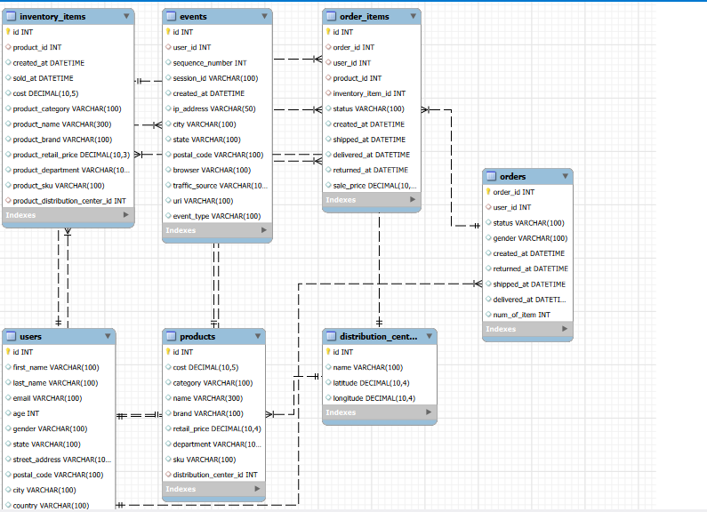
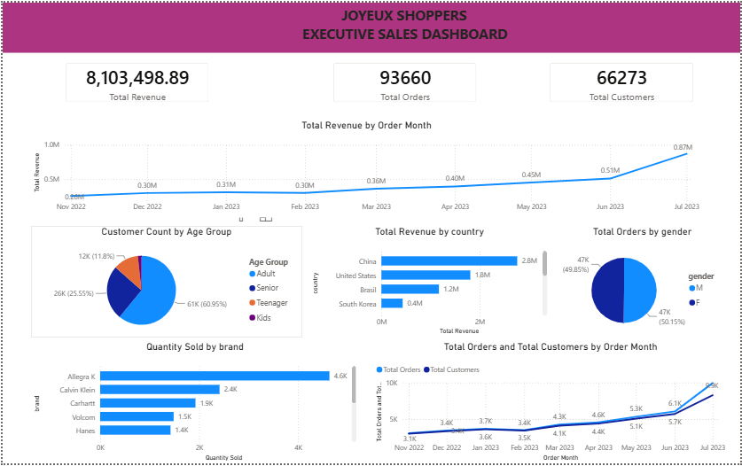

# Joyeux Shoppers Data Analysis Project

## Introduction

Welcome to the Joyeux Shoppers Data Analysis Project! This project aims to analyze sales data from an eCommerce company called Joyeux Shoppers. The project includes data preparation, loading into a MySQL database, and performing various data analysis tasks using SQL queries. The analysis covers sales metrics, demography analysis, gender analysis, age distribution analysis, top-selling products, brands, categories, best performing channels, loyalty campaign, and data presentation through visualizations on a dashboard.

## Data Preparation & Loading

### MySQL Database Creation

- Created a MySQL database named `capstone_db` on AWS RDS for MySQL using the free tier eligible instance type.

### Tables Created

1. Users
2. Orders
3. Products
4. Inventory_items
5. Products
6. Events
7. Distribution_centers

### ERD (Entity-Relationship Diagram)

- 

### SQL DDL

- `**01_capstone_db_ddl.sql**`: SQL script containing the DDL (Data Definition Language) for creating the database tables.

## Data Analysis

### Sales Analysis

- Query to calculate total revenue, sales, orders, and customer count on a monthly basis.

### Demography Analysis

- Query to display total customers by country and gender breakdown.

### Gender Analysis

- Query to show revenue generated by gender.

### Age Distribution Analysis

- Query to display order distribution across different age groups.

### Top Selling Products, Brands, Categories

- Queries to show top-selling products, categories, and brands based on quantity sold.

### Best Performing Channels

- Query to identify the top 3 best performing channels.

### Loyalty Campaign

- Query to extract the top 5 customers (based on revenue generated) from Germany who are female and purchase Calvin Klein products.

## Data Presentation

### Dashboard Visualizations

- 

1. Line graph: Revenue generated over the last 9 months.
2. Line graph: Comparison of total orders and customers over the last 9 months.
3. Bar graph: Total sales by country (top 10 countries).
4. Pie chart: Gender distribution for all orders.
5. Pie chart: Customer distribution by age group.
6. Bar chart: Top-selling brands.

## Conclusion

This README provides an overview of the Joyeux Shoppers Data Analysis Project, including database setup, data loading, analysis queries, and visualizations on a dashboard. The project aims to provide actionable insights for executive management to make informed decisions based on sales performance, customer demographics, and product analysis.
"# Weather-Forecast" 
